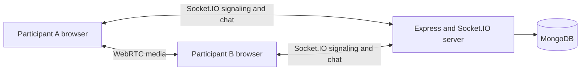

# Video Conferencing

A full-stack video-conferencing project built to explore browser media APIs, WebRTC peer connections, Socket.IO signaling, React, Express, and MongoDB. Users can create an account, join a call with a meeting code, exchange media and chat messages, and review meeting codes saved to their account history.

## Project Showcase

This project brings together two different kinds of real-time communication:

- **WebRTC** carries audio and video between participants.
- **Socket.IO** coordinates the call by exchanging signaling messages and relaying chat messages through the backend.

The backend also provides registration, login, and meeting-history endpoints. MongoDB stores user and meeting records; active call membership and chat message buffers are currently held in server memory.

## Features

- Account registration and login.
- Guest entry from the landing page, and meeting-code entry from the home page.
- Browser camera and microphone permissions with in-call audio/video controls.
- Screen-sharing controls (the screen-sharing path should be verified before relying on it in a demo).
- Meeting chat relayed through Socket.IO.
- Meeting-code history with a recorded date.
- React Router navigation and Material UI components.

## Technology

| Area | Tools |
| --- | --- |
| Frontend | React 19, Vite, React Router, Material UI |
| API | Node.js, Express 5 |
| Real-time signaling | Socket.IO |
| Audio/video | WebRTC (`RTCPeerConnection`, `getUserMedia`, and `getDisplayMedia`) |
| Persistence | MongoDB and Mongoose |
| Password storage | bcrypt |

## Architecture



The server helps participants discover one another and exchange WebRTC offers, answers, and ICE candidates. After negotiation, WebRTC sends media peer-to-peer; the Express server is not a media relay. The current peer configuration uses Google's public STUN service. A TURN service is not configured, so some networks may prevent participants from establishing a direct media connection.

## Run Locally

### Prerequisites

- Node.js and npm.
- A MongoDB instance, either local or hosted (for example, MongoDB Atlas).

### 1. Configure MongoDB

Create `backend/.env` with a MongoDB connection string:

```env
MONGO_URL=mongodb://127.0.0.1:27017/video_conferencing
```

For MongoDB Atlas, use the connection string supplied by Atlas instead. Keep `.env` private and do not commit credentials.

### 2. Start the backend

In a terminal:

```bash
cd backend
npm install
npm start
```

The API and Socket.IO server listen on port `8080`. The backend reads `MONGO_URL` from the environment and connects to MongoDB at startup.

The backend also defines an `npm run dev` script using Nodemon. Nodemon is not listed in this project's backend dependencies, so use `npm start` unless Nodemon is installed in your environment.

### 3. Start the frontend

In a second terminal:

```bash
cd frontend
npm install
npm run dev
```

Open the local URL printed by Vite, typically `http://localhost:5173`.

### Frontend checks

From `frontend/`, the available project checks are:

```bash
npm run lint
npm run build
```

## API Overview

All routes are mounted at `/api/v1/users` on the backend server.

| Method | Endpoint | Purpose |
| --- | --- | --- |
| `POST` | `/register` | Create an account from `name`, `username`, and `password`. |
| `POST` | `/login` | Validate credentials and return an opaque login token. |
| `GET` | `/get_all_activity?token=...` | Return meeting-history records associated with the token. |
| `POST` | `/add_to_activity` | Save a meeting code for the account identified by the token. Expects `token` and `meeting_code` in the JSON request body. |

The frontend sends GET query parameters through Axios's `params` option. POST data is sent as a JSON body. The backend reads those as `req.query` and `req.body`, respectively.

## Data Model

- **User:** name, unique username, bcrypt-hashed password, and an opaque login token.
- **Meeting:** user identifier, meeting code, and a date that defaults to the time the record is created.

Meeting history is persisted in MongoDB. The active Socket.IO connection lists and chat message buffers are in-memory data structures, so they are cleared when the backend process restarts.

## What This Project Demonstrates

- **Separating signaling from media:** Socket.IO exchanges session details and chat, while `RTCPeerConnection` negotiates direct media streams.
- **Working with browser permissions:** camera, microphone, and display capture are asynchronous browser APIs and require user permission.
- **Coordinating peer connections:** each participant maintains peer connections and handles offers, answers, ICE candidates, tracks, and disconnects.
- **Combining REST and real-time APIs:** Express handles account/history operations; Socket.IO handles call coordination and live chat.
- **Modeling persistent data:** Mongoose schemas store users and dated meeting-history entries.
- **Understanding request shapes:** query parameters belong to GET request configuration, while POST JSON belongs in the request body; frontend and backend must agree on the shape.
- **Managing frontend state:** React state and effects coordinate fetched history, call controls, chat, and route changes.
- **Recognizing network constraints:** STUN can help peers discover reachable network addresses, but TURN may be needed when direct connections are blocked.

## Current Limitations and Next Steps

- API and Socket.IO addresses are currently hardcoded to `http://localhost:8080` in the frontend. Use environment-based URLs for LAN testing or deployment.
- The backend and Socket.IO CORS settings allow broad origins. Restrict them to the deployed frontend origin before exposing the service publicly.
- Login tokens are stored in `localStorage`; token expiration, rotation, and stronger server-side authorization should be added before production use.
- The route guard is a client-side convenience, not a substitute for authorization on protected API routes; the current guard implementation needs review.
- Call membership and chat buffers live only in backend memory. They are not shared across multiple backend instances and chat is not persisted.
- Only a STUN server is configured. Add and test a TURN server for more reliable calls across restrictive networks.
- Browsers generally require HTTPS for camera, microphone, and display capture outside localhost. Public deployment should use HTTPS and a secure WebSocket connection.
- The backend currently listens on port `8080` directly; its `PORT` environment setting is not yet used by `server.listen`.
- Meeting-history fetching and screen-sharing behavior should be tested and hardened before presenting those flows as production-ready.

